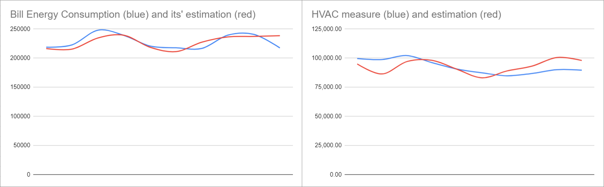

# Introduction

I was tasked with a project to estimate the HVAC energy consumption from hotels' electricity bills which contain the energy consumption of the whole building, more than just the HVAC. My company (SensorFlow) provides HVAC energy savings solutions and it's crucial to estimate the HVAC consumption before installing our products.

# Problem Formulation 
Every month billings can be very different, we need to find a factor that relates to the monthly electricity bill. Besides the billings, the hotels also provide the occupancy rate, i.e. percentage of rented rooms over the total rooms within that month. HVAC consumption will depend on occupancy rate and also on the outside weather. For the weather factor, we use the Cooling Degrees Day (CDD) which is the difference of outdoor temperature and indoor base temperature setpoint. CDD is mostly used to study the trend of energy consumption [1]. We currently focus on South East Asia areas which mostly require cooling, but the same concept can be applied for heating as well. With CDD and occupancy rate we can setup an equation relates the building energy consumption to the CDD and occupancy, Eq.(1), which is shown below
```
E = a * log(occ+c1) * CDD + b * log(occ+c2)
```
where E is the hotel electricity consumption in kWh obtained from the bill, occ is the occupancy rate, a is the cooling coefficient factor and b is the non-HVAC (electricity consumption other than HVAC) coefficient factor. c1 and c2 are the adjustment factors to determine the relation of occupancy rate to the hotel energy consumption. CDD is the monthly cooling degrees day which can be obtained on some weather API provider website, I use visualcrossing [2] to obtain this information.

The reason for using `log(occ+c1)` comes from the fact that building energy consumption grows slower than the number of people inside the building. c1 and c2 are chosen to be greater than 1 so that `log(occ+c1)` is always a positive number.

The term `a*log(occ+c1)*CDD` is the HVAC consumption because we can assume change of outside weather leads to change of HVAC consumption. The term 1b*log(occ+c2)1 represents the energy consumption other than HVAC.

# Solution
To solve for {a,b,c1,c2}, first we set an initial guess of {c1,c2} the Eq.(1) becomes a linear regression problem. With the fixed values of {c1,c2} and the historical data of CDD, E and occ we can solve for {a,b} using linear regression technique [3]. We also obtain the R-squared (R2) value which indicates the quality of the linear regression fitting, the closer R2 to one the better. This means we have a function, f(c1,c2), that takes {c1,c2} as input and returns R2.

The function f(c1,c2) can be further optimized to obtain the "optimal" pair of {c1,c2}. We formulate an optimization problem, Eq.(2), as

```
minimize J = |1-f(c1,c2)| w.r.t c1,c2
```
c1 and c2 need to be constrained in range of 1 to an upper value, e.g. 10, for the reason mentioned above.

Eq.(2) can be solved using the Nelder-Mead method [4] which does not require the knowledge of the objective function derivatives.

After this step, the optimal `{a,b,c1,c2}` can be obtained and the HVAC energy consumption can be estimated using the term `a*log(occ+c1)*CDD`.

As mentioned above, `{c1,c2}` shows how the building energy consumption depends on the occupancy rate. The smaller the values of `{c1,c2}`, the more dependent on the occupancy rate the building gets.

# Result

The methodology is validated using data from a hotel in Singapore where we installed our energy meter on the HVAC system to measure the HVAC energy consumption. The results are shown below



The figure shows very good estimation of both bill energy consumption (left chart) and the HVAC energy consumption (right chart).

# Conclusion
This post demonstrates that with limited historical data (electricity and occupancy rate) and some public weather data, we can build a pretty good prediction model for both HVAC and building energy consumption by employing linear regression and nonlinear optimization techniques.

# References
[1] en.wikipedia.org/wiki/Heating_degree_day

[2] https://visualcrossing.com

[3] en.wikipedia.org/wiki/Linear_regression

[4] en.wikipedia.org/wiki/Nelder–Mead_method

